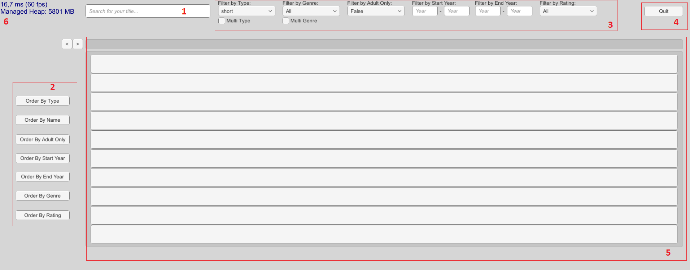
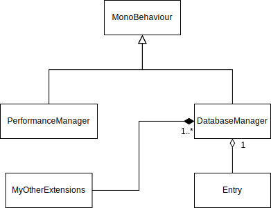

# Projeto LP2  
## Introdução
Este projeto foi desenvolvido no âmbito da disciplina de Linguagens de Programação II (LP2), onde nos foi pedido para desenvolver uma aplicação em C# que realize pesquisas na base de dados do [IMDB]. O nosso projeto foi feito em "Unity", na versão 2019.2.9f1. O projeto encontra-se no seguinte repositorio do [github].

## Autoria
Projeto desenvolvido por:

* Diogo Maia Nº 21901308
* Tiago Alves Nº 21701031

## Distribuição de Tarefas
As tarefas foram repartidas igualmente pelos 2 membros do grupo. No entanto, o Diogo Maia não conseguiu executar uma pequena parte das suas tarefas devido à sobreposição de projetos, nomeadamente o de Inteligência Artificial, ao qual deu prioridade.

## Arquitetura da Solução
### Descrição da Solução

Assim que o programa é inicializado este vai à pasta `appdata` e selecciona primeiramente o ficheiro dos _ratings_. Lê e descomprime-o, e mete-o num dicionário temporário de entries com ratings. O mesmo processo é feito para o ficheiro _episodes_ e para o _basics_ (com a diferença do _basics_ ser colocado num dicionário permanente). Os dicionários temporários são juntos ao dicionario permanente.

É mostrada ao utilizador uma U.I. com vários campos:

 Legenda: O utilizador pode escrever em [**1**], ordenar os resultados da pesquisa em [**2**], dar _toggle_ nos filtros pretendidos em [**3**], sair do programa em [**4**], ver os resultados em [**5**] e ver a performance do programa em [**6**].

O utilizador escreve o que quer pesquisar, selecciona os diferentes filtros e carrega "Enter" para iniciar a pesquisa. Após alguns segundos, são apresentados os resultados de 10 em 10. É possivel navegar pelas páginas de resultados com os botões que aparecem à esquerda dos resultados.

## Diagrama UML

## Referências
* [Código-Exemplo] do Prof. Nuno Fachada

* Agradecimento ao grupo constituido por:
    * André Pedro;
    * Inês Gonçalves;
    * Diana Nóia.

[IMDB]:https://www.imdb.com/
[github]:https://github.com/synpse/LP2Projeto1
[Código-Exemplo]:https://github.com/VideojogosLusofona/lp2_2019_p1/tree/master/sample